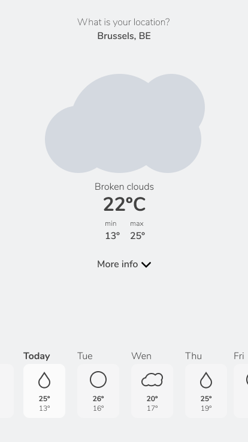
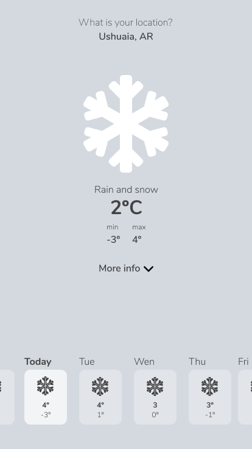
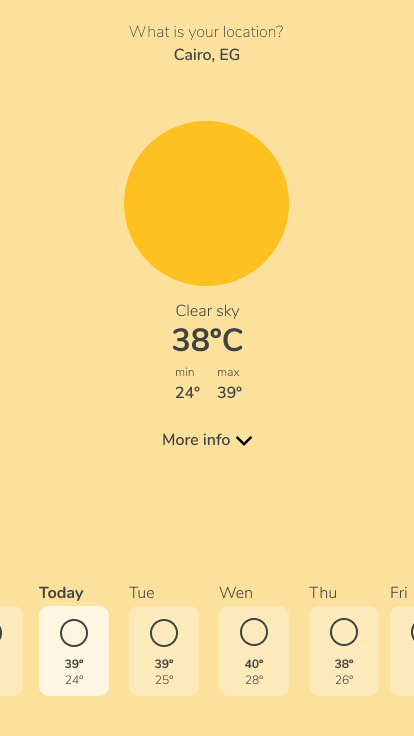
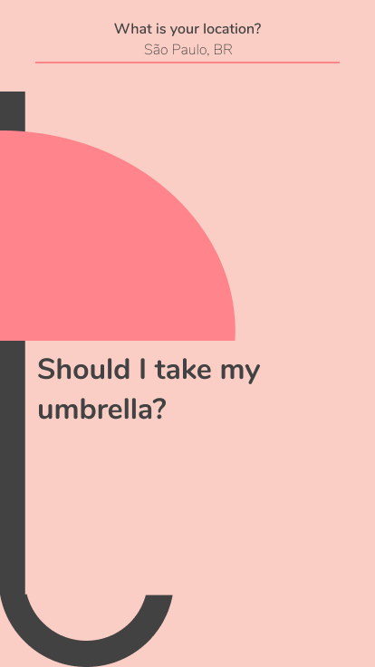
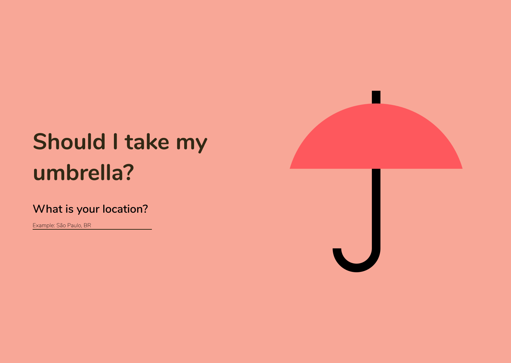

<h1 align="center" id="umbrella"> ☔ Should I take my umbrella? </h1>

<p align="center">
  A weather app so you do not get caught by surprise for the rain.
  <br>
  ⚡ To access click <a href='https://should-i-take-my-umbrella.vercel.app/'>here</a>! ⚡ 
</p>

<h4 align="center"> 
	🚧 In construction  🚧
</h4>


<p align="center">
 <a href="#-about">About</a> •
 <a href="#-development">Features</a> • 
 <a href="#-development">User Interface</a> • 
 <a href="#-getting-started">Getting Started</a> • 
 <a href="#-build-with">Build With</a> • 
 <a href="#-author">Author</a>
</p>

---

## 💡 About

The challenge was to use the [Open Weather API](https://openweathermap.org/) to create a weather app.

<p align="right">
  <a href="#umbrella"> Back to the top. </a>
</p>

---

## ⚙️ Features

The user just needs to type the city location and can see information about:

- [x] Current temperature
- [x] Info about today's weather
    - [x] Maximum e minimum tempeture
    - [x] Humidity
    - [x] Wind speed
    - [x] Sunrise time
    - [x] Sunset time

- Info about five days ago weather and six days from now
    - [x] Weather summary
    - [x] Maximum e minimum tempeture

### 🚧 Future implementations

- [ ] Get user location.
- [ ] City form autocomplete.

<p align="right">
  <a href="#umbrella"> Back to the top. </a>
</p>

---

## 🎨 User interface
The layout was designed with the Mobile First and KISS (Keep It Simple and Stupid) concept.
To focus on simplicity and send the message, the color palette changes according to the weather but keeping them in the same tone.

The family font used in the project is [Nunito](https://fonts.google.com/specimen/Nunito?query=nunito) and iconography is from [Font Awesome](https://fontawesome.com/start) library. You can see all screen prototypes on [Figma](https://www.figma.com/file/67H6oBRw0TqcV3gYmzqInr/GitHub-Projects?node-id=704%3A2).

<p align="center">
    </img>
</p>

### ✍ If it's a cloudy day: the main color is gray

<p align="center">
    </img>
    <br>
    🔎 Click on the image to enlarge 
</p>

### ✍ If it's a rainy day: the main color is blue

<p align="center">
    </img>
    <br>
    🔎 Click on the image to enlarge 
</p>

### ✍ If it's a snowing day: the main color is white

<p align="center">
    </img>
    <br>
    🔎 Click on the image to enlarge 
</p>

### ✍ If it's a sunny day: the main color is yellow

<p align="center">
    </img>
    <br>
    🔎 Click on the image to enlarge 
</p>

### ✍ Home mobile

<p align="center">
    </img>
    <br>
    🔎 Click on the image to enlarge 
</p>

### ✍ Home Desktop

<p align="center">
    </img>
    <br>
    🔎 Click on the image to enlarge 
</p>

<p align="right">
  <a href="#umbrella"> Back to the top. </a>
</p>

---

## 🚀 Getting Started

📂 The file is structured as follows:

```text
./
├── .gitignore
├── README.md
├── package.json
├── package-lock.json
├── img
├── public
│   ├── index.html
│   └── manifest.json
└── src
    ├── App.js
    ├── index.css
    ├── index.js
    ├── reportWebVitals.js
    ├── components
    │   ├── LocationForm
    │   │   ├── index.jsx
    │   │   └── style.css
    │   ├── Logo
    │   │   ├── index.jsx
    │   │   └── style.css    
    │   ├── WeatherDetails
    │   │   ├── index.jsx
    │   │   └── style.css
    │   ├── WeatherIcon
    │   │   ├── index.jsx
    │   │   └── style.css
    │   ├── WeatherInfo
    │   │   ├── index.jsx
    │   │   └── style.css
    │   └── index.jsx
    ├── services
    │   └── index.js
    └── utils
        ├── adapter.js
        └── index.js
```

🔰 Before running the app, you need to have installed these tools on your computer: [Git](https://git-scm.com) and [Node.js](https://nodejs.org/en/).

```bash

# Fork the repository

# To clone this repository on your computer run:
$ git clone https://github.com/beatrizpenalva/should-i-take-my-umbrella.git

# To install the dependencies in your project's directory run:
$ npm install

# To execute the app on development  mode run:
$ npm run start

# The app will be open on port:3000 - access http://localhost:3000

```

👊 To contribute to this project:

```bash

# After installing the repository on your computer, create a new branch with your updates:
$ git checkout -b my-feature

# Save your changes
$ git add .

# Create a commit message telling what you did:
$ git commit -m "feature: My new feature"

# Send your contribution to this repository
$ git push origin my-feature

```

<p align="right">
  <a href="#umbrella"> Back to the top. </a>
</p>

---

## 👩‍💻 Build With

&nbsp;
🛠 React.JS

&nbsp;
🛠 JavaScript ES6

&nbsp;
🛠 HTML5

&nbsp;
🛠 CSS3

<p align="right">
  <a href="#umbrella"> Back to the top. </a>
</p>

---

## 🦸 Author

<p align="center">
  Developed with ❤️ by <a href="https://github.com/beatrizpenalva">Beatriz Penalva</a>, find me on <a href="https://www.linkedin.com/in/beatrizpenalva/">Linkedin</a>. 👋
</p>

<p align="center">
  </img>
</p>

<p align="right">
  <a href="#umbrella"> Back to the top. </a>
</p>
